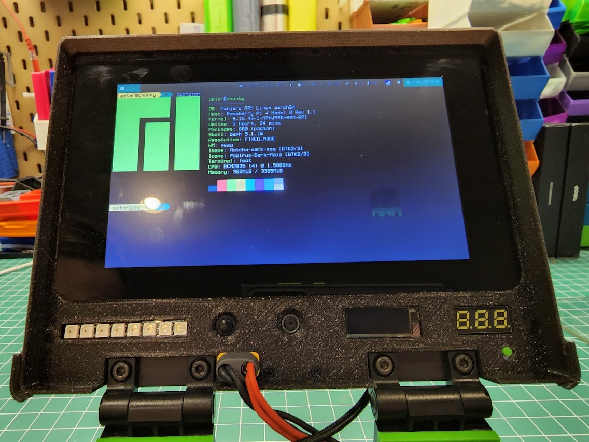

# Fus3d Chonky
After seeing the original Chonky Palmtop I realized I had many of the same parts
on hand already and given my current interest in ergo mech keyboards it was a
perfect fit.   However I had some different requirements.  A 5 row keyboard
wasn't going to work for me so I expanded the keyboard trays and overall size
to support the extra row.  The monitors I had were the RPI 7" display so the
design needed to be reworked for that.  The resolution on the RPI screen is
worse than the originally spec'd one but it is still useable.  I wanted to be
able to use the RPI Video out to support additional monitors so I reoriented
the RPI and exposed those ports.  I also wanted to use up the extra space
provided on the screen bezel so I added some neopixels, a RPI camera, and a I2C
screen.  Additionally the power button, multimeter and XT60 hookup have been
adjusted for space.

## Additional Requirements
- Ability to disconnect keyboard from RPI to use it on other systems
- Camera for Video Conferencing
- Exposed HDMI ports for external monitor connections
- Corne keyboard with 6 rows (instead of 5 as on the original Chonky)
- oled screen for keyboard
- pimoroni trackball for keyboard

## Todo
- Enable non-working components (trackball, oled)
- Add clasps to the outside to keep it closed in transit
- Battery status on RPI
- Speakers
- Keyboard LEDs (I avoided this at first due to some power concerns I had but I
  think I'd rather have it, at least a general backlight if not full RGB per
  key)

## Design
Thanks to a8ksh4 for making the onshape links available.  Using them, I was
able to modify the parts for my needs.   Other than the hinges and keyboard
slider parts everything has been adjusted for the 6 row keyboard size.   The
display bezel and components have almost all been remade from scratch to
accomodate for the different screen and added components.  

This version still has a multimeter connected to the LS pin of the Ampripper
3000.   This should give "battery voltage when discharging and system voltage
when charging".  I put the multimeter on a momentary button so that I can check
status periodically without having it in my face the whole time.  Also the LS
pin of the ampripper is always on so the multimeter wouldn't turn off when the
EN pin is disconnected.

[Onshape Models](https://cad.onshape.com/documents/b660fb934f42fd645deb3fbe/w/3176a45797060d52070b3125/e/4b153ee5366d2e144ed84390 "Onshape Models")

## Wiring
Most of the wiring follows the original design.  I have mounted a USB hub but
it's not wired in at the moment (I don't trust myself to solder to USB on the
PI to be honest, I just have bad luck with those sorts of connections).  The
XT60 has been moved to the front display to allow the battery to be completely
disconnected from the electronics and facilitate using the keyboard without the
raspberry pi.   

Each of the screen components is wired with JST SM connectors so they can be
removed or adjusted.   The raspberry pi connections are also terminated in this
way.

Two lever release connectors serve as the power and ground distribution.  These
are held down with a touch of hot glue.

## OS
The system runs Manjaro Sway on a 4Gb Raspberry Pi 4.  The Sway interface which
mirrors i3 functionality fits very well the corne keyboard.  The trackball
isn't working at the moment because I have rarely had need to use the trackball
instead of keyboard driven commands and touch screen.  The 800x480 resolution
could definately be improved but it is very useable with the appropriate
scaling / fonts.   The ability to wire in an external monitor adds to the
functionality of it. 

[Manjaro Sway](https://github.com/Manjaro-Sway/manjaro-sway)

### Fonts / Scaling
Capturing some of the scaling settings I'm using to make the system useable:

#### /etc/sway/outputs/default-screen
''' output DSI-1 scale .8 '''

#### /etc/sway/themes/matcha-green/foot.ini
''' font=TerminessTTF Nerd Font Mono:pixelsize=18:fontfeatures=ss01 '''

#### /etc/sway/themes/matcha-green/definitions (not sure these are being used)
'''
set $gui-font Noto Sans 11
set $term-font TerminessTTF Nerd Font Mono 14
'''

#### ~/.config/waybar/style.css
'''
* {
...
font-family: "FontAwesome 5 Free Solid", "TerminessTTF Nerd Font", sans-serif;
font-size: 14px;
...
}

# Sections from the Original Chonky Palmtop README 

### Pivot Geometry
One corner of each keyboard half moves up the center of the chassis on a
straight path.  The other pivot point follows some other path to acheive the
desired total rotation, and we have some control over how it gets there by
curving the path it follows.

We can figure out the starting and ending points of the second pivot by
projecting it's location in the closed and open positions, and then drawing a
path between them.  See the yellow lines in the cad sketch below.  We use a
path that first curves down to help us dip the keyboard around the hinges that
hold the display.  

## Power System
The PSU/Charge controller is an Amp Ripper 3k, which seems to work well
satisfying the Pi 4 and display without low voltage warnings.  It can be wired
so an external switch, and has a signal pin to indicate low, but doesn't seem
to actually be able to disconnect your system from the battery if voltage gets
too low, so you should include some additional low voltage protection.  It
charges at up to 3a via USB-c port:  

This build has two li-ion pouch cells wired in parallel, each separatly fused
for 10a for short curcuit protection.  There's an XT60 connection on the side
    in case I want to rig up a fast-charge.  The li-on cells used here aren't
    the best choice for energy density, but they can fast charge  - limited
    only by the gauge of the wire I connect tehm with, and if I change them
    later, there's room in the battery box for a bunch of 18650 cells instead.  

Display Keeps the keyboard closed when folded:

## Materials List
* Printed parts - See the "Stl Files" derectory.
* Pi 4 (4gb minimum)
* Ampripper 3k PSU/Charger: https://www.tindie.com/products/kickstart_design/ampripper-3000-5v-3a-lipo-battery-charger/
* Chonker spim08hp cells:https://batteryhookup.com/products/2x-spim08hp-3-7v-8ah-cells-with-threaded-insert
* 7" Touchscreen: https://www.amazon.com/gp/product/B07L6WT77H/
* USB Hub: https://www.amazon.com/gp/product/B00L2442H0/
* Hinges: https://www.amazon.com/gp/product/B07GX8LQCX/
* Bolt and Nut Kit: https://www.amazon.com/gp/product/B093FWLJZC/
* 1/4" Screws: https://www.amazon.com/gp/product/B00GDYNHL6/
* 3/8" Screws: https://www.amazon.com/gp/product/B00GDYNJNM/
* Crkbt Classic PCB: https://www.littlekeyboards.com/collections/corne-pcb-kits/products/crkbd-classic-essentials-kit
* Your choice of choc switches.
* Diodes
* mcu, e.g. pro micro or elite c
* Machine Pin Sockets for mcu: https://www.adafruit.com/product/3647, https://www.adafruit.com/product/3646
* Keycaps: https://www.littlekeyboards.com/collections/keycaps/products/mbk-choc-low-profile-keycaps
* 22 Gauge Silicon Wire: https://www.amazon.com/gp/product/B07T4SYVYG/
* 18 Gauge Silicon Wire: https://www.amazon.com/gp/product/B073RDBW7L/
* In-line Fuses: https://www.amazon.com/gp/product/B07ZTYN9DY/ (higher amperage would be better maybe)
)
* XT60 Connector: https://www.amazon.com/gp/product/B01ETROGP4/
* Voltage Indicator: https://www.amazon.com/gp/product/B00YALUXH0/
* 6mm Tactile Buttons:  https://www.adafruit.com/product/367
* 6mm Clear Top Buttons: https://www.adafruit.com/product/4183
* Switch: https://www.amazon.com/gp/product/B008CZIG3I/

## License
Creative Commons Share Alike
